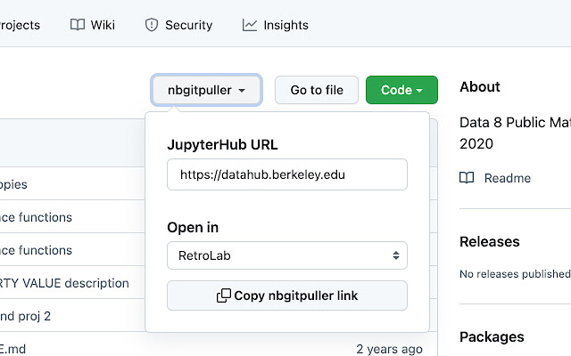

# Distributing Notebooks

[nbgitpuller](https://nbgitpuller.readthedocs.io/) links launch students into a notebook on JupyterHub by pulling the assignment from Github. If you are using a JupyterHub instance for your course,  we recommend using nbgitpuller links to distribute notebooks to students. If you are running notebooks locally, you should instead distribute assignments through a learning management system (LMS). In this case, after you have uploaded the files to the LMS, students will need to download them and run it locally on their computers.

## What are nbgitpuller links?

nbgitpuller links simplify the assignment distribution process. Rather than downloading files from an external source and then uploading to their personal JupyterHub accounts, users can obtain all files for a given assignment with just one click. When a user clicks on an nbgitpuller link for a particular assignment, all files for the assignment will show up in the user's personal JupyterHub account.

These links can be used with any content stored on GitHub in a public repository. nbgitpuller links can be generated for an entire repository, or a particular file or folder. When a link is clicked, a series of Git commands are run from the user's JupyterHub account, which is why nbgitpuller links must be used with content on GitHub. They cannot be used to pull arbitrary files from sources other than GitHub.

Using these links enables users to immediately interact with publicly available content on GitHub. This is valuable for easy assignment distribution, but also in the broader context of using the open-source content that is available on GitHub. Students do not have to learn Git in order to interact with this content.

## How do nbgitpuller links work?

Here is an nbgitpuller link with the various components highlighted in different colors. The grey portions of the link are needed for formatting and will remain the same for each links. The colored portions will be different for each link. If you are new to GitHub you may want to familiarize yourself with the basics \(repositories, branches, etc.\) to better understand each component.

The above link does the following:

* Clones the repo `ds-modules/SW-282` into the user's account on the JupyterHub at `https://datahub.berkeley.edu`
* Checks out to the `main` branch (this is the default, but specifiable)
* Opens the file `lab04/lab04.ipynb` on the `datahub.berkeley.edu` JupyterHub. The full path of this file on the user's JupyterHub account would be `~/SW-282/lab04/lab04.ipynb`.

## Workflow

Here are the basic steps you will need to go through to distribute notebooks and other files.

1. Create a folder with all files for the assignment \(notebook, datasets, etc.\)
2. Upload the folder to a public GitHub repository
3. Generate an nbgitpuller link for the folder using the [nbgitpuller link generator](https://nbgitpuller.readthedocs.io/en/latest/link.html) (more on this below)
4. Distribute the link to students through a course web page or LMS.

### nbgitpuller Link Generator

nbgitpuller links can be manually created in the format shown above, or can be automatically generated using [this](https://nbgitpuller.readthedocs.io/en/latest/link.html) tool. The nbgitpuller link generator tool allows users to specify a JupyterHub URL and GitHub url as inputs. The tool will generate an nbgitpuller link for the specified GitHub content and JupyterHub.

For example, to pull [this repo](https://github.com/ds-modules/SW-282/tree/master/lab04/lab04.ipynb) into the JupyterHub at `https://datahub.berkeley.edu`, we would fill out the nbgitpuller link generator with:

1. Fill in the JupyterHub URL field with `https://datahub.berkeley.edu`
2. Paste the GitHub URL **to the repo** in the Git Repository URL field: `https://github.com/ds-modules/SW-282`
3. Leave the Branch field blank, because it defaults to `master`
4. Fill in the File to Open field with the path to the file: `lab04/lab04.ipynb`

After finishing these steps, the link in the grey text box will be your nbgitpuller link.

### nbgitpuller Chrome-Extension Link Generator

The other option for generating links is to install this [chrome-extension](https://chrome.google.com/webstore/detail/nbgitpuller-link-generato/hpdbdpklpmppnoibabdkkhnfhkkehgnc)

A button, like one displayed below, appears when you are browsing a Github repository. It will generate the link for the folder or file you are current viewing. It is a bit easier than the nbgitpuller link generator website detailed above because all you need to do is tell the drop-down what JupyterHub you would like the link to indicate.

### An important note

The technology behind nbgitpuller links, called nbgitpuller, pulls _all files_ from a repo into the user's JupyterHub account. This means that **you should not store unfinished materials and answer keys in the same repo as published assignments**. Any nbgitpuller link for a published assignment would also distribute the unfinished materials and answer keys to the students, which you probably do not want. Instead, **we recommend that you use a public repo for published assignments and a private repo for unfinished materials and answer keys**.
